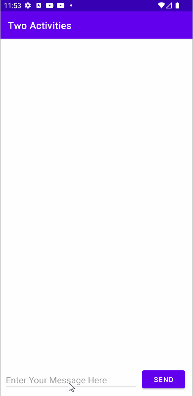
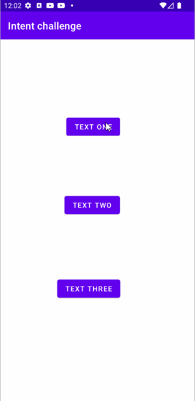

# Activities-and-intents
task challenge homework 

challenges 

homework 

<b>Question 1</b> 

What changes are made when you add a second Activity to your app by choosing File > New > Activity and an Activity template? 
-> The second Activity is added as a Java class, the XML layout file is created, and the AndroidManifest.xml file is changed to declare a second Activity.

<b>Question 2</b> 

What happens if you remove the android:parentActivityName and the elements from the second Activity declaration in the AndroidManifest.xml file? 

-> The Up button in the app bar no longer appears in the second Activity to send the user back to the parent Activity.

<b>Question 3</b> 

Which constructor method do you use to create a new explicit Intent? 

-> new Intent(Context context, Class<?> class)

<b>Question 4</b> 

In the HelloToast app homework, how do you add the current value of the count to the Intent? 

-> As an Intent extra

<b>Question 5</b> 

In the HelloToast app homework, how do you display the current count in the second "Hello" Activity? 

-> All of the above.

